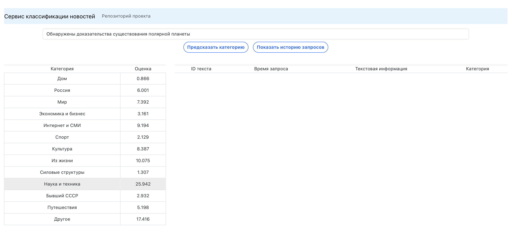
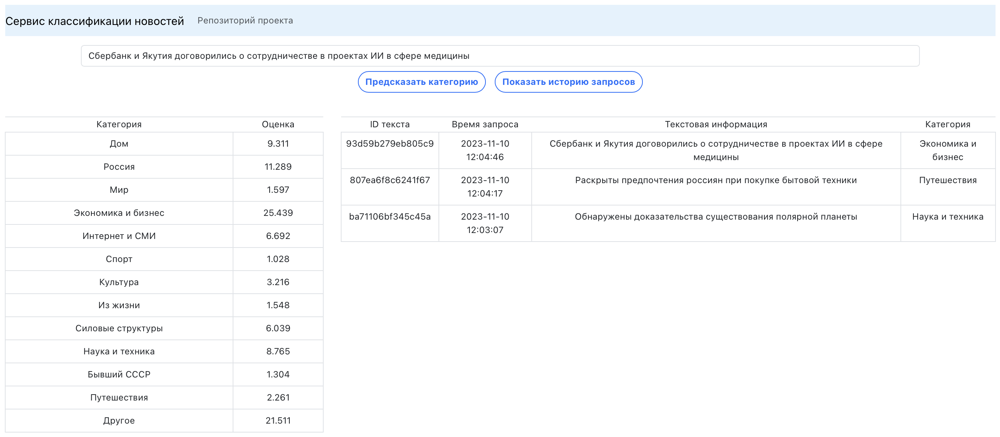

# Russian news classifier

# RU

### 1. Введение
-----

Целью проекта является создание системы классификации новостных заголовков

В качестве новостных заголовков и категорий используется [датасет Lenta.ru](https://www.kaggle.com/datasets/yutkin/corpus-of-russian-news-articles-from-lenta)

Целевая метрика при обучении F1-macro (~0.63)

### 2. Структура проекта
-----

- `api`: содержит back-часть системы, включая сам классификатор, завернутый в FastAPI, коннектор к MongoDB
- `artifacts`: содержит модель и декодер категорий новостей
- `notebooks` содержит скрипты исследования (.py формата):
  - `src`: готовые классы / утилиты для исследований
  - `data_preprocessing.py`: преобразование новостей в удобный формат для исследования
  - `tf_idf_baseline.py`: пайплайн с помощью TF-IDF + LogReg (OneVsAll classifier)
  - `fast_text_solution.py`: пайплайн с помощью FastText
- `web`: содержит web-часть системы (простой интерфейс с отображением)

### 3. Установка и запуск системы
-----

Убедитесь, что у Вас установлен Docker на локальной машине. В случае отсутствия, перейдите
[сюда](https://docs.docker.com/get-docker/) и проследуйте по инструкции.
Затем перейдите в командую строку и выполните следующие команды:

1. <code>git clone https://github.com/unkmlenjoyer/news_classificator_service.git</code>
2. Перейдите в каталог `/api`
3. Создайте `.env` файл с 4 переменными:

    `APP_HOST`=0.0.0.0
    `APP_PORT`=5050
    `DB_CONTAINER_NAME`=news_db
    `DB_PORT`=27017

4. Вернитесь на уровень выше и выполните следующую команду

   <code>docker compose up --build</code>

5. Теперь можно перейти в web-интерфейс системы:

   `localhost:3000`

   Доступ к API: `localhost:5050`

### 4. Пример использования
-----

На главном экране достаточно ввести необходимый текст и нажать кнопку "Предсказать категорию".

После нажатия слева появится таблица категорий и значений оценок.

Предыдущие 10 запросов на предсказание можно просмотреть прямо на данной странице: достаточно кликнуть на "Показать историю запросов"

# EN

### 1. Intro
-----

The aim of the project is to create a classification system for news headlines

The following [Lenta.ru dataset](https://www.kaggle.com/datasets/yutkin/corpus-of-russian-news-articles-from-lenta) is used for training.

Target metric for training is F1-macro (~ 0.63)

### 2. Project structure
-----

- `api`: back part of service: api with classificator (Fast API), MongoDB connector.
- `artifacts`: model and category decoder
- `notebooks`: research scripts
  - `src`: research classes & utils
  - `data_preprocessing.py`: data transforming into special form for training
  - `tf_idf_baseline.py`: training pipeline with TF-IDF & LogReg (OneVsAll classifier)
  - `fast_text_solution.py`: training pipeline with FastText
- `web`: simple React web-app

### 3. Installation
-----

Be sure that Docker is installed on your local machine. If not, go [there](https://docs.docker.com/get-docker/) and do following instructions. Then go to command line and execute commands:

1. <code>git clone https://github.com/unkmlenjoyer/news_classificator_service.git</code>
2. Go to `/api` folder
3. Create `.env` file with two variables (without symbols <>)

    `APP_HOST`=0.0.0.0
    `APP_PORT`=5050
    `DB_CONTAINER_NAME`=news_db
    `DB_PORT`=27017

4. Then get back to main directory and run:

   <code>docker compose up --build</code>

5. Now you can visit web-part of service:

   `localhost:3000`

   API: `localhost:5050`

### 4. Examples of usage
-----

On the main page you can paste text of news headline and press "Предсказать категорию" button.

The last 10 requests can be viewed by clicking on the button "Показать историю запросов".

